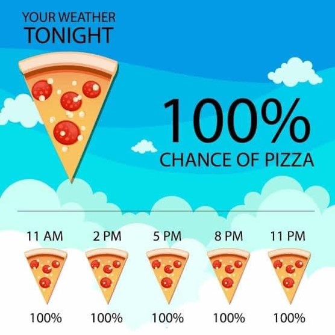

# Pizza Weather Patterns

## Project Description
This project was created to fulfill the Capstone requirement for the May 2023 session of ***Data Analytics with Python*** 
through [CodeKentucky](https://codekentucky.org/ "CodeKY") now known as Code:You.

This project takes a look at business data from a local pizza restaurant in Kentucky to analyze revenue and the number of orders 
per day against weather data for the same time period. Please see the Data Interpretation and Analysis section below for more 
information on the results.

The restaurant data was obtained and approved for use by the restaurant owner, and the weather data was obtained via a 
free data download from Visual Crossing Weather (https://www.visualcrossing.com/weather-data). Both the sales
and weather data span 2.5 years of information from March 2021 through October 2023. 

### Project Features
In order to meet the requirements for the course, the following features have been included:
1. Loading data by reading in 2 CSV files
2. Data has been cleaned, merged using Pandas merge to combine datasets, and then used to calculate new values
3. Created at least 3 visualizations using matplotlib, seaborn, or other plotting library
4. Created a virtual environment for running this project (including requirements.txt file) with instructions below
5. Well written README.md and clear comments throughout the Jupyter notebook.

Thank you for stopping by and taking the time to check out my project! :) 

## How to run this project

### Instructions
1. Clone the repo to your machine.
2. Create and activate a virtual environment and install the packages listed in the requirements.txt file. (instructions below)
3. Run the Jupyter Notebook 
4. Review content, output, and visuals with ***wonder*** and ***amazement***!

### Virtual Environment Instructions
1. After you have cloned the repo to your machine, navigate to the project folder in GitBash/Terminal.
2. Create a virtual environment in the project folder.
3. Activate the virtual environment.
4. Install the required packages.
5. When you are done working on your repo, deactivate the virtual environment.

### Virtual Environment Commands

| Command    | Linux/Mac                       | GitBash                         |
|------------|---------------------------------|---------------------------------|
| Create     | python3 -m venv venv            | python -m venv venv             |
| Activate   | source venv/bin/activate        | source venv/Scripts/activate    |
| Install    | pip install -r requirements.txt | pip install -r requirements.txt |
| Deactivate | deactivate                      | deactivate                      |

## Data Interpretation and Analysis

### Hypothesis
At the start of this project, it was my hypothesis that I would see some sort of inverse trend between the temperature
and the number of pizza orders (i.e. - as the temperature went down, the number of orders would go up). I also thought 
there might be a direct correlation between the presence of precipitation (rain or snow) and the number of orders 
(i.e - an increase in pizza orders when rain or snow was present). 

### Findings
1. While a link between precipitation and pizza orders may exist in small pockets, there was not enough evidence to say for sure they were directly related. 
2. When looking at the sales data on individual days, there does appear to be a minor correlation with the temperature outside and the revenue of the store indicating that the warmer the temperature, the higher the revenue.

### Conclusion
Overall, it seems that most people in this part of the state just ***LOVE*** their weekend pizza - mostly on 
Friday and Saturday, but on Sunday too - and not much about weather appears to have an impact on their ordering habits
since there does not appear to be any major swings in ordering habits based on temperature or precipitation.  

Additional analysis could be done to look into the hourly weather data versus the hourly ordering for this restaurant. 
Downloading that amount of data would have required a subscription or locating another source for the weather data
and that felt out of time and scope for delivering this project. 

